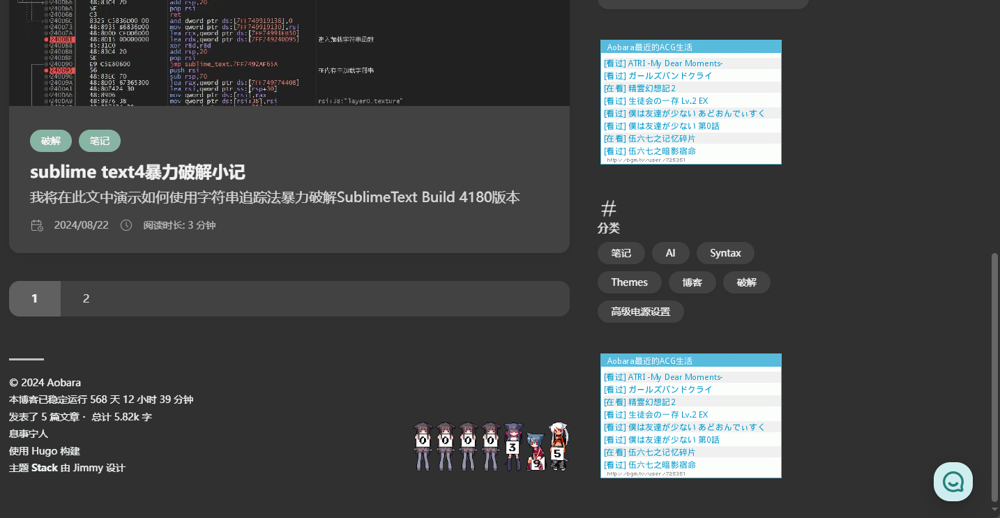

+++
author = "aobara"
title = "关于使用 CoT ( Chain of Thought ) 的思想来改善 AI 生成的代码质量的研究笔记"
description = "图文无关，这不是很酷嘛（bushi"
date = "2024-10-06"
categories = [
    "AI",
    "笔记",
]
image = "title.jpg"
+++
封面来源：*https://x.com/horodamsmr/status/1763534593364566270/photo/1*
## 起因
最近在将 MoeCounter[^1] 配置到我的博客上，但是博主没有什么前端经验,所以HTTP,CSS部分只能交给AI。令我没想到的是这个想法从0到1花了整整半天的时间，其中大部分的时间花在了与AI协商代码部分上，而这其中的大部分又花在了明确我的需求上。我事成之后想了想如果一开始AI知道命令有歧义并与我继续沟通以明确我的需求而不是自己通过瞎猜来消除歧义的话，是不是我可以花更少的时间来完成这个项目呢？于是我开始了这次研究。
## 提示词编写基础
对于想通过 Prompt engineering 来改善LLM的人来说，吴恩达的 LLM-Cookbook[^2] [^3] 仍是一门要看的课程。对于我这种不使用ChatGPT的人来说，与ChatGPT接轨的部分可以完全不用学，所以接下来我仅仅总结了一些通用的LLM使用技巧。(基本上以引用LLM-Cookboook为主)
### 原则一 编写清晰、具体的指令
#### 使用分隔符清晰地表示输入的不同部分
用"""，< >，<tag> </tag>，”:“来做语义分割  
like this:
```python3
text = f"""
您应该提供尽可能清晰、具体的指示，以表达您希望模型执行的任务。\
这将引导模型朝向所需的输出，并降低收到无关或不正确响应的可能性。\
不要将写清晰的提示词与写简短的提示词混淆。\
在许多情况下，更长的提示词可以为模型提供更多的清晰度和上下文信息，从而导致更详细和相关的输出。
"""
# 需要总结的文本内容
prompt = f"""
把用三个反引号括起来的文本总结成一句话。
```{text}```

```
#### 寻求结构化的输出
例如JSON、HTML等
#### 要求模型检查是否满足条件
人话是如果条件本来就是错误的就别让LLM继续生成了。  
like this:
```python3
# 满足条件的输入（text中提供了步骤）
text_1 = f"""
泡一杯茶很容易。首先，需要把水烧开。\
在等待期间，拿一个杯子并把茶包放进去。\
一旦水足够热，就把它倒在茶包上。\
等待一会儿，让茶叶浸泡。几分钟后，取出茶包。\
如果您愿意，可以加一些糖或牛奶调味。\
就这样，您可以享受一杯美味的茶了。
"""
prompt = f"""
您将获得由三个引号括起来的文本。\
如果它包含一系列的指令，则需要按照以下格式重新编写这些指令：

第一步 - ...
第二步 - …
…
第N步 - …

如果文本中不包含一系列的指令，则直接写“未提供步骤”。"
```
#### 提供少量示例（a.k.a. few shot learning）
like this:
```python3
prompt = f"""
您的任务是以一致的风格回答问题。

<孩子>: 请教我何为耐心。

<祖父母>: 挖出最深峡谷的河流源于一处不起眼的泉眼；最宏伟的交响乐从单一的音符开始；最复杂的挂毯以一根孤独的线开始编织。

<孩子>: 请教我何为韧性。
"""
```
### 原则二 给模型时间去思考
#### 指定完成任务所需的步骤
like this:
```python3
prompt_2 = f"""
1-用一句话概括下面用<>括起来的文本。
2-将摘要翻译成英语。
3-在英语摘要中列出每个名称。
4-输出一个 JSON 对象，其中包含以下键：English_summary，num_names。

请使用以下格式：
文本：<要总结的文本>
摘要：<摘要>
翻译：<摘要的翻译>
名称：<英语摘要中的名称列表>
输出 JSON：<带有 English_summary 和 num_names 的 JSON>

```
#### 指导模型在下结论之前找出一个自己的解法
先让ai推理答案，再让AI对比它的答案与你的答案。
## 正戏
### 导入
为什么要讲基础呢？我们不妨看看在LLM-Cookbook里是如何介绍思维链的。  
> 有时，语言模型需要进行详细的逐步推理才能回答特定问题。如果过于匆忙得出结论，很可能在推理链中出现错误。因此，我们可以通过“思维链推理”（Chain of Thought Reasoning）的策略，在查询中明确要求语言模型先提供一系列相关推理步骤，进行深度思考，然后再给出最终答案，这更接近人类解题的思维过程。...
  
> 具体来说，Prompt可以先请语言模型陈述对问题的初步理解，然后列出需要考虑的方方面面，最后再逐个分析这些因素，给出支持或反对的论据，才得出整体的结论。这种逐步推理的方式，更接近人类处理复杂问题的思维过程，可以减少语言模型匆忙得出错误结论的情况。因为它必须逐步论证自己的观点，而不是直接输出結论。通过详细的思维链提示，开发者可以获得语言模型生成的结论更加可靠，理由更加充分。这种提示设计技巧值得在需要语言模型进行复杂推理时加以运用。
> 
关键词：明确相关推理步骤，列出需要考虑的方方面面，避免匆忙得出结论。  
你会发现，思维链与我们的第一个和第二个原则相符。你可能觉得自己平时说话很清楚且具体，但事实上对于一个完全没有前端基础的人来说，你很难真正意义上去给出编写清晰、具体的指令。如我希望这部分以响应式布局的形式来生成，希望它能使用某些东西来构建，但若是我啥也不懂，我该如何指示AI生成我理想中的功能呢，**这是我们去设计思维链地目的：让不专业的人也能实现自己的想法。**  
如何做呢？  
**我们可以通过设计一个与程序相关的思维链来不断提示我们我们需要的东西，以此来让我们的指令更清晰、具体。**
### 思维链的设计
#### 明确目的
我们要先明确我们的目的：  
- 首先我们要先让AI复述一遍我们的指令，以确保AI是否正确定位指令。
- 然后我们让AI审视指令并与我们沟通来让我们的指令更清晰、具体。
- 最后，AI会将我们讨论的所有结果整理成文档或列表的形式
- 预处理后我们将输出结果提供给负责编写代码的AI。  

#### 思维链部分
我写的提示词：
```javascript
你是一位专业的前端开发者，当你接受到需要你根据需求来生成代码的指令后，按照下面的流程进行生成：
1.复述指令 - 请先复述您收到的任务指令，以确保正确理解了任务的要求。请先询问客户是否是这个指令再进行下一步
2.审视与格式化 - 接下来，请仔细审查任务指令，并将任何不清晰或需要进一步说明的部分以列表形式列出。
3.提问细化需求 - 对于上述列出的不明确部分，请提出具体问题，以便更好地了解功能的使用场景、预期的输入与输出，以及它如何与其他系统集成等细节。
4.引导目标思考 - 引导用户提供关于最终产品的目标用户群体和目标的信息，这将有助于确定功能开发的优先级和设计方向。
5.确认目前的需求是否能生成需要的功能 &quot;&quot;&quot; 如果不满足则重复2-4步,并复述已经讨论好的指令。&quot;&quot;&quot;如果满足则复述已经讨论好的需求并询问客户是否满意
6.得到肯定答复后开始按指令生成
````
#### 评估

> Prompt:   *我想将在hugo-theme-stack 中添加这个东西< img src="http://bgm.tv/chart/img/xxxxxxx" border="0" alt="xxxxxxx 的个人主页" />**

沟通过程看图：  

  

最后给的代码网址改为你要的网址，效果如下：  

   

 没事，小改一下就正常了：  

    
  
  最后的代码：( .\themes\hugo-theme-stack\layouts\partials\sidebar\right.html )
  ```<!DOCTYPE html>
{{- $scope := default "homepage" .Scope -}}
{{- $context := .Context -}}
{{- with (index .Context.Site.Params.widgets $scope) -}}
    <aside class="sidebar right-sidebar sticky">
        {{ range $widget := . }}
            {{ if templates.Exists (printf "partials/widget/%s.html" .type) }}
                <!-- Ensure that the `params` is not nil -->
                {{- $params := default dict .params -}}

                {{ partial (printf "widget/%s" .type) (dict "Context" $context "Params" $params) }}
            {{ else }}
                {{ warnf "Widget %s not found" .type }}
            {{ end }}
        {{ end }}

        <!-- 添加图像显示代码 -->
        <div class="image-container">
            <a href="#">
                
            </a>
        </div>
    </aside>
{{ end }}

<!-- 添加 CSS 样式 -->
<style>
    .image-container {
        margin: 4px;
    }
</style>
```
  ## 总结：
  生成效果还不错，但还是有小问题，不过可以让AI修改。相较于未使用提示词的AI来说，这个AI能够通过提问来了解我们真正的需求，从而提高效率。
## 扩展阅读
Wei, J., Wang, X., Schuurmans, D., Bosma, M., Ichter, B., Xia, F., Chi, E., Le, Q., & Zhou, D. (2023). *Chain-of-Thought Prompting Elicits Reasoning in Large Language Models*. arXiv preprint arXiv:2201.11903. [https://arxiv.org/abs/2201.11903](https://arxiv.org/abs/2201.11903)

Ng, A. (2023). *LLM-Cookbook*. GitHub. Retrieved October 6, 2024, from [https://github.com/datawhalechina/llm-cookbook](https://github.com/datawhalechina/llm-cookbook)

Wei, J., Wang, X., Schuurmans, D., Bosma, M., Ichter, B., Xia, F., Chi, E., Le, Q., & Zhou, D. (2022). *Chain-of-Thought Prompting Elicits Reasoning in Large Language Models*. arXiv preprint arXiv:2210.03493. [https://arxiv.org/abs/2210.03493](https://arxiv.org/abs/2210.03493)

[^1]:https://github.com/journey-ad/Moe-counter
[^2]: https://github.com/datawhalechina/llm-cookbook
[^3]: https://learn.deeplearning.ai/
