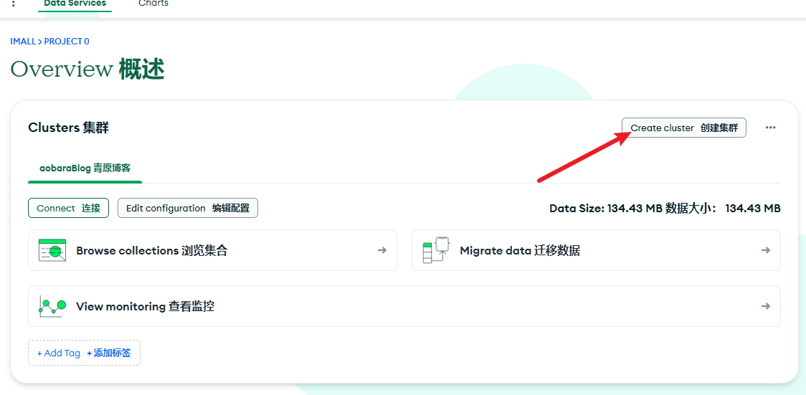
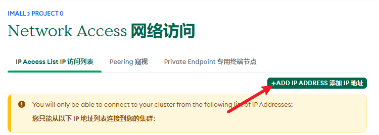
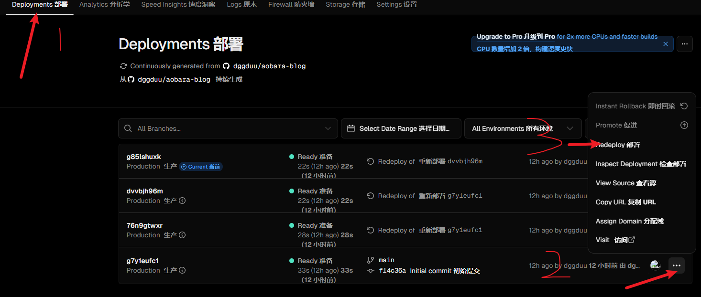
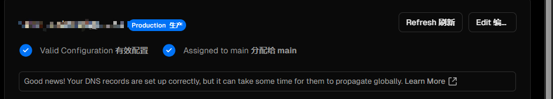

+++
author = "aobara"
title = "2024年 mongoDB + twikoo 博客评论系统搭建踩坑小记"
date = "2024-10-04"
categories = [
    "博客",
    "笔记",
]
image = "title.png"
+++

## 前言
可能有人觉得这有什么好写的，网上不都有吗[^1] [^2]。的确，但是我在实际的配置中仍遇到了一些问题，很多都是因为相关网站改版导致的。此文是写给想要在2024年配置 mongoDB + twikoo + vercel 的人的。

## 闲话少说
### 申请或购买一个国内可用的域名（必须）
没啥好讲的  
### 数据库部分
免费版512MB应该还是够用了。当然，你可以不使用 mongoDB ，换成国内的数据库也没事。这里我图免费就使用 mongoDB 。
| 计划类型 | 每小时费用 | 存储 | 内存 | vCPU | 描述 |
| --- | --- | --- | --- | --- | --- |
| 免费 | $0 | 512 MB | 共享 | 共享 | 适用于在云环境中学习和探索MongoDB。 |
| 专用 (M10+) | $0.08 | 10 GB | 2 GB | 2个vCPU | 适用于具有复杂工作负载需求的生产应用。 |
| 无服务器 | $0.10/1百万次读取 | 最高1TB | 自动扩展 | 自动扩展 | 适用于应用程序开发和测试，或流量变化大的工作负载。 |
#### 注册
https://www.mongodb.com/  
#### 创建集群
 

 - 套餐选免费（M0）的那个
 - Provider：AWS
 - Region:用默认HK也行，用N.Virgnia也行(没啥玄学，哪个服务器不容易起火就用哪个，建议选后者)
 #### 配置集群
 当你创建完集群后，在图1界面点击 Connect
 - Set up connection security：
     - 在 **Add a connection IP address** 下点击蓝色的 ` Network Access
 `   

  点击  `ADD IP ADDRESS`  键入 0.0.0.0/0 （**！此步必要**）
    - 在 **Create a database user** 下输入用户名与密码 （请保存好你的密码，建议放到记事本里）
- Choose a connection method：
选 Drivers
- Connect:
    - 3. Add your connection string into your application code下复制mongodb+srv://userName:<db_password>...开头的的一串（建议放入记事本）   

将<db_password>替换为你刚刚设的密码


### 云函数部署部分
你可以使用自己想要的部署网站，请查看 [Twikoo](https://twikoo.js.org/backend.html) 官网查看。  
这里我使用 vercel。

 #### 注册
 [vercel 官网](https://vercel.com/)  
 三个单点登录任选。这里我用 github 登录。

#### 部署
https://vercel.com/import/project?template=https://github.com/twikoojs/twikoo/tree/main/src/server/vercel-min
- 在 Create Git Repository下找到Repository Name (注意，名字决定了vercel为你分配的域名)
- 点击 `Create` ,等待部署成功后再点击 `Continue to DashBoard`
#### 设置环境变量
- 在上方找到 `Settings` 
- 在侧边栏找到 `Environment Variables`
- 下面的 key 填  `MONGODB_URI` , Value 填 上面 mongodb+srv://userName... 开头的东西（记得替换密码！）最后点击 `Save`
##### 题外话
如果你在创建集群时没有选择N.Virgnia，则要在侧边栏的 Functions 中将 Function Region 改为你创建集群时选择的地方。
#### 再次部署
 
- 记得在弹窗界面勾选上 Use existing Build Cache 。
- 等待 status 变为 ready , domins 生成一个短域名（e.g. ...vercel.app ）
- 使用魔法打开域名，若配置成功则可看到：
```javascript
{
    "code": 100,
    "message": "Twikoo 云函数运行正常，请参考 https://twikoo.js.org/frontend.html 完成前端的配置",
    "version": "1.6.39"
}
````

### 绑定自己的域名
vercel.app 在国内的解析不正常（dddd）,但是绑了自己域名后可正常使用。  
在 vercel - settings - Domains -输入你的域名，再加上你的子域名（e.g. twikoo.example.com）- Add  
域名报错处有名称域名，记住它们  
我的域名托管于 cloudflare ，所以这里我使用 cloudflare 做演示:
- 打开 [cloudflare](https://cloudflare.com/)
- 网站-点击你的域名
- DNS - DNS 记录
- 点击 `添加记录` 类型 CNAME ，名称域名输之前的-保存
- 在 vercel 中 `refresh` 直至如下图所示：(可能要等很久)
 
- 使用新域名看看能不能出现这个：
```javascript
{
    "code": 100,
    "message": "Twikoo 云函数运行正常，请参考 https://twikoo.js.org/frontend.html 完成前端的配置",
    "version": "1.6.39"
}
```
### 前端部署
不同博客主题配置方法不同，具体请查阅Twikoo文档[^1]
我使用的是hugo-theme-stack，所以只演示hugo-theme-stack的配置方法：
- 找到hugo.yaml
- 找到这个并改成这样：
```yaml
    comments:
        enabled: true
        provider: twikoo
```
- 向下找到这个并改成这样：(！注意一定一定要加https://)
```yaml
        twikoo:
            envId: "https://twikoo.example.com/"
            region:
            path:
            lang:
```
## 简单配置下twikoo
### 点击小齿轮设置密码，一定要记住！！！
### 配置头像服务
在配置管理-通用-GRAVATAR_CDN处键入头像服务：这里我使用的是 cravatar.cn  

其他自行摸索，祝你好运！😉
[^1]:[Twikoo文档](https://twikoo.js.org/)
[^2]: [在静态博客里添加Twikoo评论系统，并配置邮箱和TG通知](https://thirdshire.com/twikoo-tutorial/#3-%E8%AE%BE%E7%BD%AE%E5%8D%9A%E5%AE%A2)