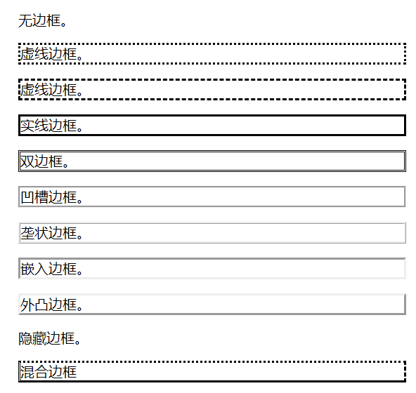
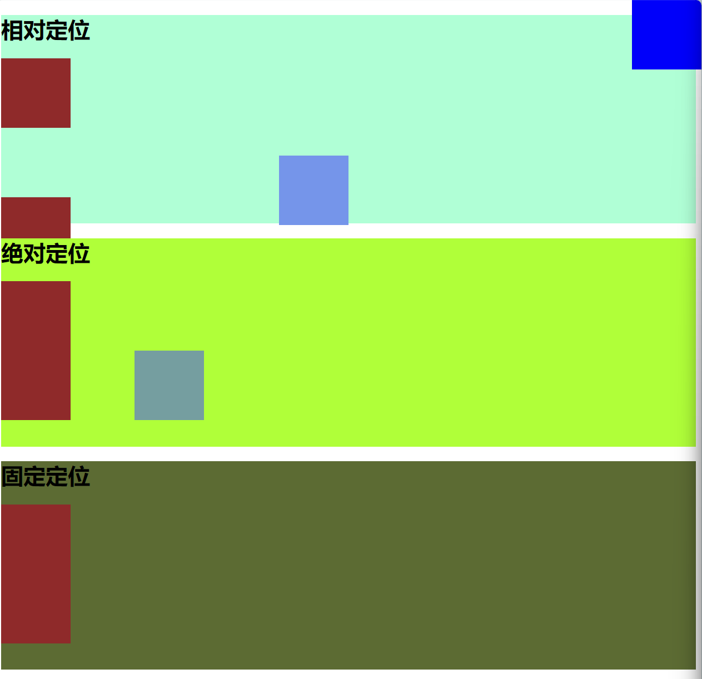

+++
author = "aobara"
title = "我的前端三剑客学习笔记"
description = ""
date = "2024-11-17"
categories = [
    "编程",
    "笔记",
]
image = "1.jpg"
+++
## 前置操作
visual studio code 安装`HTML CSS Support`，`LIVE Server`和`auto rename tag`
## HTML 笔记
```html
    <h1>HelloWorld!!!</h1>
    <h2>writer:aobara</h2>
    <h3>三级标签</h3>
    <h4>四级标签</h4>
    <h5>五级标签</h5>
    <h6>六级标签</h6>
    <p>段落标签，<b>加粗</b><i>斜体</i><u>下划线</u><s>删除线</s></p>
    <p>下一行  ，<strong>使用'strong'也可以加粗</strong></p>

<br>换行  
<hr>分割行
```
### 插入图片
**属性名称不区分大小写，属性值区分大小写**  
e.g.
```html
    
    
    
```
一二作用一样但三与一二都不一样。
### 插入表格
#### 无序列表（`<ul>`）
```html
    <ul>
        <li>这是无序列表(unorder)</li>
        <li>这是无序列表(unorder)</li>
        <li>这是无序列表(unorder)</li>
        <li>这是无序列表(unorder)</li>

    </ul>
    <dl>
        <li>这也是无序列表，但不缩进</li>
        <li>这也是无序列表，但不缩进</li>
        <li>这也是无序列表，但不缩进</li>
        <li>这也是无序列表，但不缩进</li>
    </dl>
```
每一项前会有`·`  
#### 有序列表（`<ol>`）
```html
    <ol>
        <li>这是有序列表1（order）</li>
        <li>这是有序列表2</li>
        <li>这是有序列表3</li>
        <li>这是有序列表4</li>
    </ol>
```
每一项前有数字序号`1.`  
#### 表格
```html
table row(行，tr)
table header(列,th)
td=tableDate
t

    <table>
        <th>列标题1</th>
        <th>列标题2</th>
        <th>列标题3</th>
        <th>列标题4</th>
        <tr>
            <td>元素1</td>
            <td>元素2</td>
            <td>元素3</td>
            <td>元素4</td>
        </tr>
        <tr>
            <td>元素1</td>
            <td>元素2</td>
            <td>元素3</td>
            <td>元素4</td>
        </tr>
    </table>

```
表格标签属性：  
border="4"  //数字越大表格边框越粗
#### 表单标签
```html
    <form action="https://www.aobaradgg.us.kg">
        <span>密码</span>
        <input type="text" placeholder="输入内容"><br>
        <label for="password">密码</label>
        <input type="password" id="password" value="input content">
        //value本身也作为input的内容
        <br>
        <input type="radio" name="gender"> 1
        <input type="radio" name="gender"> 2
        <input type="radio" name="gender"> 3
        <br><br>
        <label for="habit">habit</label>
        <input type="checkbox" id="habit" name="habit"> 1
        <input type="checkbox" id="habit" name="habit"> 2
        <input type="checkbox" id="habit" name="habit"> 3
        <br>
        <input type="submit">
    </form>

```
action属性表示表单要返回到哪里
##### 单选框
```html
        <input type="radio" name="gender"> 1
        <input type="radio" name="gender"> 2
        <input type="radio" name="gender"> 3
```
##### 复选框
```html
        <input type="checkbox" id="habit" name="habit"> 1
        <input type="checkbox" id="habit" name="habit"> 2
        <input type="checkbox" id="habit" name="habit"> 3
```


## CSS 笔记
优先级：内联>内部>外部
### 使用类型
#### 内联
```css
<h1 style="color: aqua;">内联样式</h1>
```
#### 内部
``` css
/*插在<head>标签内*/
    <style>
        p {
            color :blue;
            font-size: 20px;;
        }

        h2 {
            color: brown;
            font-size: 20;
        }
    </style> 
```
#### 外部
```css
/*目录下新建css文件夹，在此文件夹下新建style.css文件*/
h3 {
    color: rgb(0, 255, 4);
}
```


### 选择器
#### 元素选择器（Element Selector）：
通过元素名称选择 HTML 元素。  
如下代码，p 选择器将选择所有 <p> 元素:  
```css
p {
  color: blue;
}
```
#### 类选择器（Class Selector）：
通过类别名称选择具有特定类别的 HTML 元素。  
类选择器以 . 开头，后面跟着类别名称。  
如下代码，.highlight 选择器将选择所有具有类别为 "highlight" 的元素。  
```css
.highlight {
  background-color: yellow;
}
```
#### ID 选择器（ID Selector）：
通过元素的唯一标识符（ID）选择 HTML 元素。  
ID 选择器以 # 开头，后面跟着 ID 名称。  
如下代码，#aobara 选择器将选择具有 ID 为 "aobara" 的元素。  
```css
#aobara {
  width: 200px;
}
```
#### 属性选择器（Attribute Selector）：
通过元素的属性选择 HTML 元素。属性选择器可以根据属性名和属性值进行选择。
如下代码，input[type="text"] 选择器将选择所有 type 属性为 "text" 的 `<input> `元素。
```css
input[type="text"] {
  border: 1px solid gray;
}
```
#### 后代选择器（Descendant Selector）：
通过指定元素的后代关系选择 HTML 元素。

后代选择器使用空格分隔元素名称。

如下代码，div p 选择器将选择所有在 <div> 元素内的 <p> 元素。
```css
div p {
  font-weight: bold;
}
```
#### 分组选择器
```css
h1,h2,p
{
    color:green;
}
```
#### 嵌套选择器
p{ }: 为所有 p 元素指定一个样式。
.marked{ }: 为所有 class="marked" 的元素指定一个样式。  
.marked p{ }: 为所有 class="marked" 元素内的 p 元素指定一个样式。  
p.marked{ }: 为所有 class="marked" 的 p 元素指定一个样式。  
实例:  
```css
p
{
    color:blue;
    text-align:center;
}
.marked
{
    background-color:red;
}
.marked p
{
    color:white;
}
p.marked{
    text-decoration:underline;
}
```


### CSS 背景
#### 定义页面背景
```css
 body {
    background-color: cadetblue;
}
```
#### 背景图像
```css
        body {
            background-repeat:no-repeat;
            background-image:url(https://666.com/www.png);
        }
```

### 盒子模型
Margin(外边距) - 清除边框外的区域，外边距是透明的。  
Border(边框) - 围绕在内边距和内容外的边框。  
Padding(内边距) - 清除内容周围的区域，内边距是透明的。  
Content(内容) - 盒子的内容，显示文本和图像。  
### 边框样式
#### border-style
none: 默认无边框  
dotted: 定义一个点线边框  
dashed: 定义一个虚线边框  
solid: 定义实线边框  
double: 定义两个边框。 两个边框的宽度和 border-width 的值相同  
groove: 定义3D沟槽边框。效果取决于边框的颜色值  
ridge: 定义3D脊边框。效果取决于边框的颜色值  
inset:定义一个3D的嵌入边框。效果取决于边框的颜色值  
outset: 定义一个3D突出边框。 效果取决于边框的颜色值  



#### border-width 边框宽度
上右下左  
左右互补，上下互补，只有一个值共用

### CSS Display与Visibility
隐藏元素:  
display:none 元素不再占用空间。  
visibility: hidden 使元素在网页上不可见，但仍占用空间。  
```css
内联元素(inline)特性：  
和相邻的内联元素在同一行;
宽度(width)、高度(height)、内边距的top/bottom(padding-top/padding-bottom)和外边距的top/bottom(margin-top/margin-bottom)都不可改变，就是里面文字或图片的大小;

块级元素主要有：
 address , blockquote , center , dir , div , dl , fieldset , form , h1 , h2 , h3 , h4 , h5 , h6 , hr , isindex , menu , noframes , noscript , ol , p , pre , table , ul , li

内联元素主要有：  
a , abbr , acronym , b , bdo , big , br , cite , code , dfn , em , font , i , img , input , kbd , label , q , s , samp , select , small , span , strike , strong , sub , sup ,textarea , tt , u , var
可变元素(根据上下文关系确定该元素是块元素还是内联元素)：

applet ,button ,del ,iframe , ins ,map ,object , script

```

### 链接样式
```css
a:link {color:#000000;}      /* 未访问链接*/
a:visited {color:#00FF00;}  /* 已访问链接 */
a:hover {color:#FF00FF;}  /* 鼠标移动到链接上 */
a:active {color:#0000FF;}  /* 鼠标点击时 */
```
### 水平 & 垂直对齐
#### 元素居中对齐
```css
margin: auto;
```
#### 文本居中对齐
```css
text-align: center;
```
#### 图片居中对齐
```css
img {
    display: block;
    margin: auto;
    width: 40%;
}
```
#### 左右对齐
- 相对定位
```css
position: relative;
left: 200px;
/* 相对左偏200px*/
...
```
**不破坏文档流**
- 绝对定位
```css
position: absolute;
left: 200px;
/* 相对左偏200px*/
```
**破坏文档流**
- 固定定位
```css
position: fixed;
right: 0px;
top: 0px;
/*必须要定义位置，否则不显示*/
```
**破坏文档流**



###Grid布局
```css
display:grid;//启用grid布局


grid-template-columns: 1fr 1fr 1fr 1fr;//设置列数
grid-template-rows: ;//设置行数

1fr==自由空间。多个fr则是等分页面。
2fr，1fr//r若有两个fr，则2fr为fr的两倍，或是2/3;

column-gap: 20px;//设置列间距
row-gap: 10px;//设置行间距
```