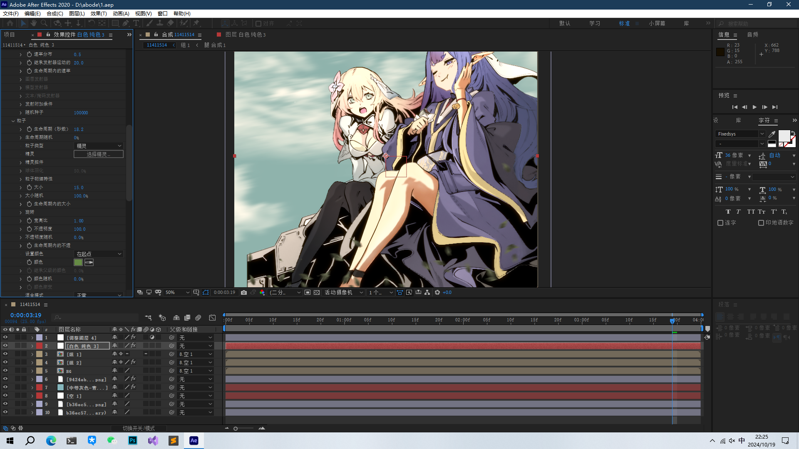

+++
author = "aobara"
title = "黑白漫画上色小记"
date = "2024-10-17"

categories = [
    "PS",
    "笔记",
]
image = "1.png"
+++
## 前言
没啥东西发就发点这个算了，但占着公共资源多少又有点不好，所以分享点东西算了。  
原图来源：  
[【第56話①】なぜ僕の世界を誰も覚えていないのか？](https://comic-walker.com/detail/KC_001367_S/episodes/KC_0013670006100011_E?episodeType=first)
## 预处理
因为抓的是ComicWalker源所以没啥扫图会出现的问题要处理，但是因为原图画质比较低，所以我这里只进行放大处理并进行降噪。  
这里提供更专业和更完整的笔记：（膜拜大佬orz）  
https://www.bilibili.com/read/cv28155859/?from=search&spm_id_from=333.337.0.0  
### 放大
估计大家都有，这里不展开说了。我用的是 RealCUGAN.  
### 降噪
这里使用 Topaz DeNoise 6 .(我电脑带不动AI就没有使用AI版)。
## 主要流程
### 抠图
没啥好讲的。
### 上色
先找几张彩图做参考。  
可以看看这些：  
BV1Xo4y1V73G  
BV1T6mKYoEqU  
BV1Cq4y1B7bz  
两种方法：  
1.从原图层修改：
- 渐变映射
- 改饱和度
2. 新建剪切蒙版
- 首先新建一个正片叠底的蒙版，对扣好的图层按 <kbd>Ctrl</kbd>在进行涂色。
- 你也可以在蒙版上用渐变。
- 再复制一次把混合模式为柔光。

## 附录：
顺手拖入AE做壁纸去了...本来是想传B站的，但是bilibili二压得实在是看不得，以前无脑小丸就行的，现在都要二压了（害）。等我研究一下看看能不能再写一篇笔记吧。

 