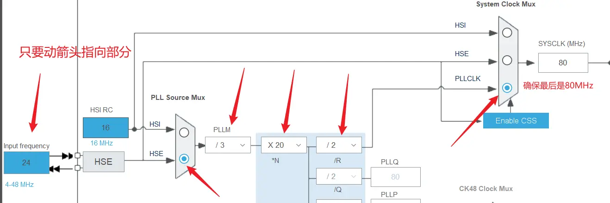
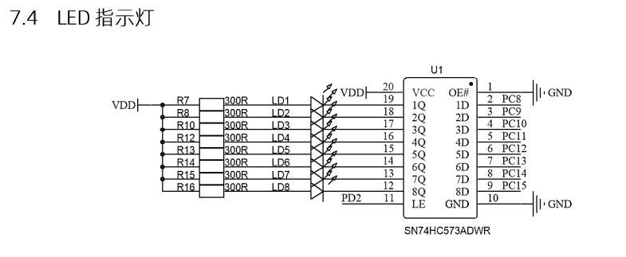
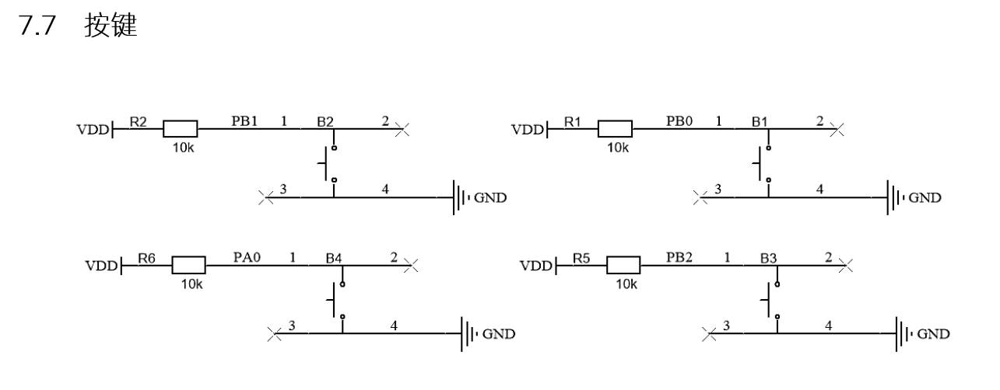
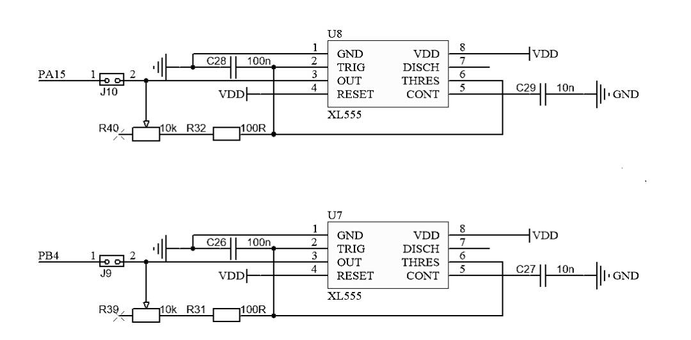
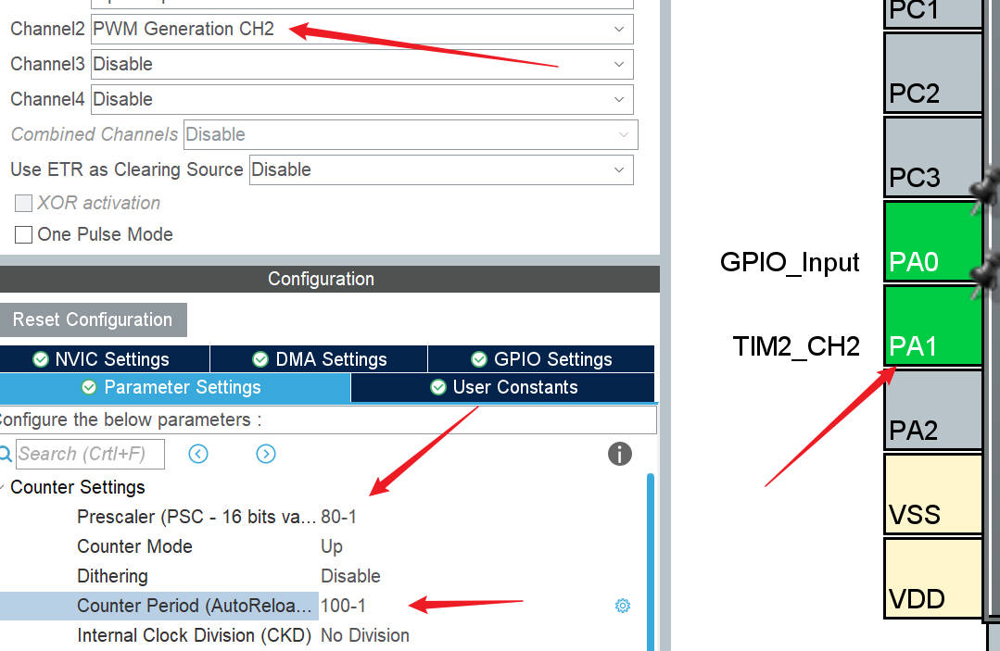
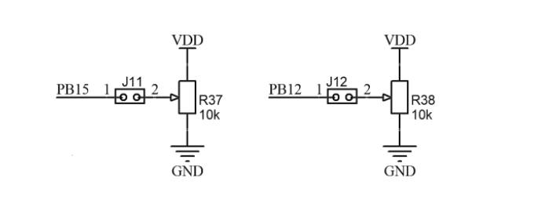
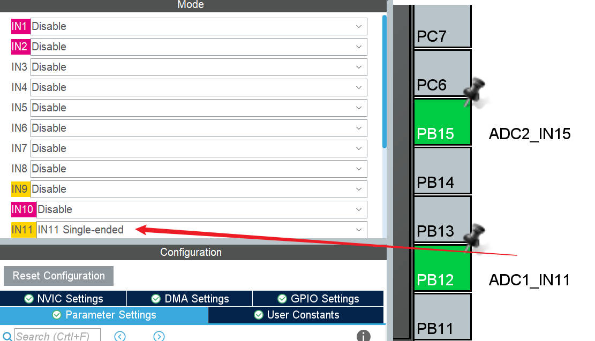
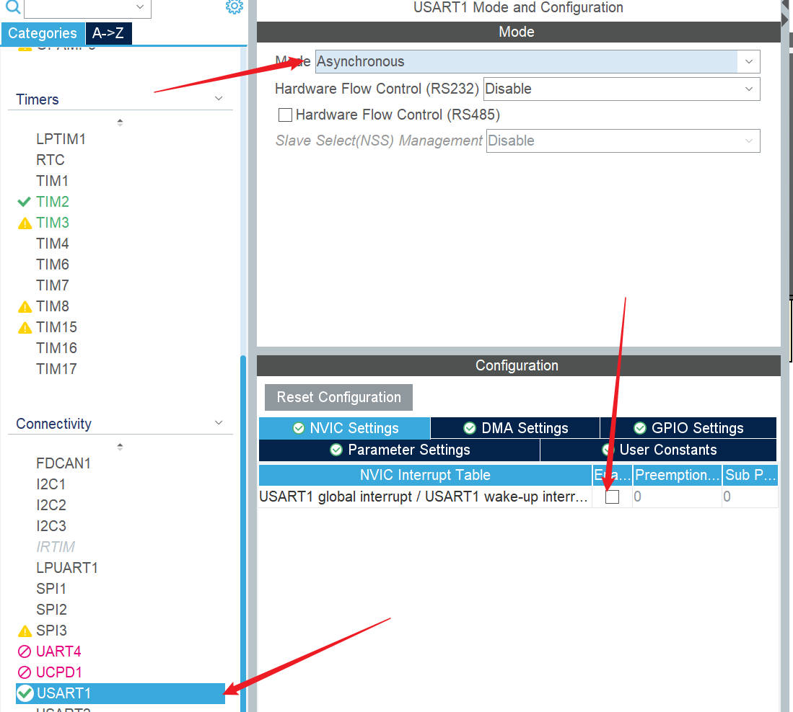
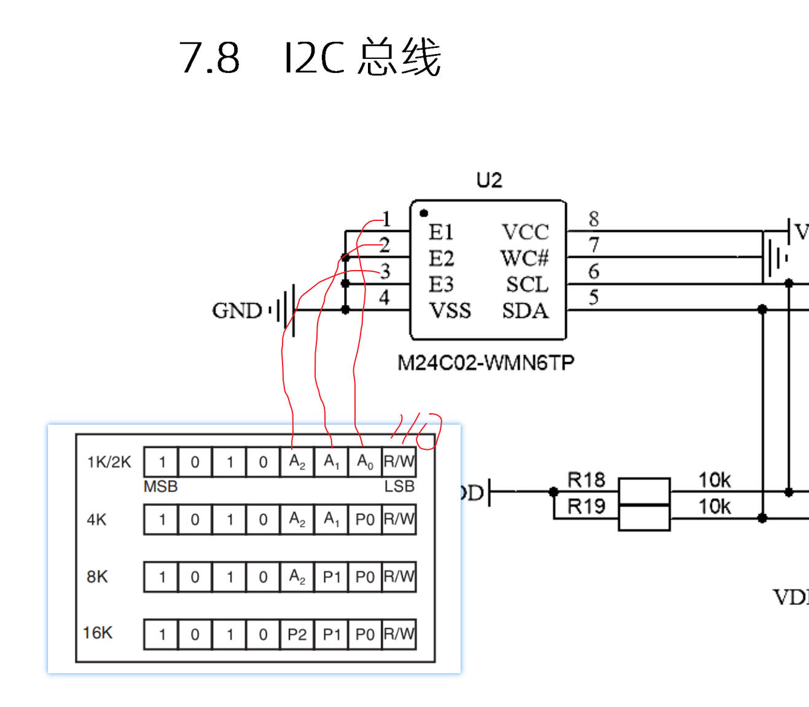
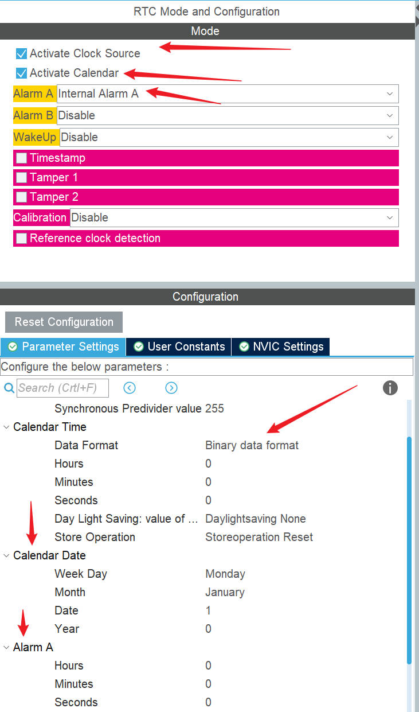

+++
author = "aobara"
title = "蓝桥杯嵌入式学习笔记"
date = "2025-03-03"
categories = [
    "STM32",
    "笔记",
]
+++
## 起手式
1.RCC-High Speed Clock (HSE)->CrystaI/Ceramic Resonator  
2.配置频率  
    
3.进入工程，点击魔术棒。Debug-Use:CMSIS-DAPDebugger  
4.点击旁边的Setting-FlashDownload:勾选Reset and Run  
## 点亮LED灯
    
  我们要配置PC8-15,PD2的引脚，**将他们设置为GPIO-OUTPUT**.同时由图知PC8-15为高电平时灯不亮，PD2为使能引脚，高电平是控制灯亮。  
  **所以我们默认设置PD2为低电平，PC8-15为高电平**  
我们要用到的函数：  
  ```c
  GPIO_PinState HAL_GPIO_ReadPin(GPIO_TypeDef *GPIOx, uint16_t GPIO_Pin);
void HAL_GPIO_WritePin(GPIO_TypeDef *GPIOx, uint16_t GPIO_Pin, GPIO_PinState PinState);
void HAL_GPIO_TogglePin(GPIO_TypeDef *GPIOx, uint16_t GPIO_Pin);
  ```
### 编写一个控制第几个灯开关的函数
原理：
```c
#define GPIO_PIN_0   ((uint16_t)0x0001) 
#define GPIO_PIN_1   ((uint16_t)0x0002) 
#define GPIO_PIN_2   ((uint16_t)0x0004) 
#define GPIO_PIN_3   ((uint16_t)0x0008) 
#define GPIO_PIN_4   ((uint16_t)0x0010) 
#define GPIO_PIN_5   ((uint16_t)0x0020) 
#define GPIO_PIN_6   ((uint16_t)0x0040) 
#define GPIO_PIN_7   ((uint16_t)0x0080) 
#define GPIO_PIN_8   ((uint16_t)0x0100) 
#define GPIO_PIN_9   ((uint16_t)0x0200) 
#define GPIO_PIN_10  ((uint16_t)0x0400) 
#define GPIO_PIN_11  ((uint16_t)0x0800) 
#define GPIO_PIN_12  ((uint16_t)0x1000) 
#define GPIO_PIN_13  ((uint16_t)0x2000) 
#define GPIO_PIN_14  ((uint16_t)0x4000) 
#define GPIO_PIN_15  ((uint16_t)0x8000) 
#define GPIO_PIN_All ((uint16_t)0xFFFF) 
```
**实际上是左移关系(0x0200<<1=0x0400)**  

**但要注意  
GPIO_PIN_3 ((uint16_t)0x0008)与GPIO_PIN_4 ((uint16_t)0x0010)和  
GPIO_PIN_11 ((uint16_t)0x0800)与GPIO_PIN_12 ((uint16_t)0x1000)   
并不满足这个小妙招**  
示例代码：  
```c
void led_show(uint8_t index,int opeator){
  HAL_GPIO_WritePin(GPIOD,GPIO_PIN_2,GPIO_PIN_SET);
  if(opeator==1){
    HAL_GPIO_WritePin(GPIOC,GPIO_PIN_All,GPIO_PIN_SET);
    HAL_GPIO_WritePin(GPIOC,GPIO_PIN_8<<(index-1),GPIO_PIN_RESET);
  }else{
    HAL_GPIO_WritePin(GPIOC,GPIO_PIN_All,GPIO_PIN_RESET);
    HAL_GPIO_WritePin(GPIOC,GPIO_PIN_8<<(index-1),GPIO_PIN_SET);
  }
  HAL_GPIO_WritePin(GPIOD,GPIO_PIN_2,GPIO_PIN_RESET);
}
```
## 按键操作
### 原理
     
  
设置PB0-2,PA0为GPIO-INPUT,PULL-UP(上拉是高电平，按下时低电平)  
示例代码：
```c
uint8_t btn1;
uint8_t btn1last;
uint8_t btn2;
uint8_t btn2last;
uint8_t btn3;
uint8_t btn3last;
uint8_t btn4;
uint8_t btn4last;
void readbtnpin(){
    btn1=HAL_GPIO_ReadPin(GPIOB,GPIO_PIN_0);
    btn2=HAL_GPIO_ReadPin(GPIOB,GPIO_PIN_1);
    btn3=HAL_GPIO_ReadPin(GPIOB,GPIO_PIN_2);
    btn4=HAL_GPIO_ReadPin(GPIOA,GPIO_PIN_0);
  if(btn1==0&&btn1last==1){
      led_show(1,1);
    }else if(btn2==0&&btn2last==1){
      led_show(2,1);
    }else if(btn3==0&&btn3last==1){
      led_show(3,1);
    }else if(btn4==0&&btn4last==1){
      led_show(4,1);
    }
  btn1last=btn1;
  btn2last=btn2;
  btn3last=btn3;
  btn4last=btn4;
}
```
示例2：  
```c
u8 key_scan()           //按键按下判断
{
  if(HAL_GPIO_ReadPin(GPIOB,GPIO_PIN_0)==GPIO_PIN_RESET)
    return 1;
  else if(HAL_GPIO_ReadPin(GPIOB,GPIO_PIN_1)==GPIO_PIN_RESET)
    return 2;
  else if(HAL_GPIO_ReadPin(GPIOB,GPIO_PIN_2)==GPIO_PIN_RESET)
    return 3;
  else if(HAL_GPIO_ReadPin(GPIOA,GPIO_PIN_0)==GPIO_PIN_RESET)
    return 4;
  return 0;//按键置空时用这个
}


  key_value = key_scan();
  key_down = key_value&(key_value^key_old);
  //置空（0x00）&(0x00^0x11);异或后维持原样（0x11）
  key_up =~key_value&(key_value^key_old);
  key_old = key_value;
  switch(key_down)//开始key_down的判断
  {
    case 1:
        break;
    case 2:
      break;
    case 3:
      break;
    case 4:
      break;
  }
  //开始key_up的特判
  //长按b3,松开运行函数
  if(key_up == 3)//在这里加长按的代码（需加个按下的flag）
```
### 按键防抖
```c
//检测上次按下的时间>=50ms  加在有关key的函数最前面  
if(uwTick-KEY_uwTick<50)return;
```
## LCD 操作相关
### 配置lcd相关函数
1.将资料包中的lcd.h与lcd.c，font.h移入工程，并链接。  
### 解决与LED串线的问题
打开lcd.c，在
```c
void LCD_Init(void)
void LCD_Clear(u16 Color)
void LCD_DisplayStringLine(u8 Line, u8 *ptr)//用到啥啥就要加

首行加：
uint16_t temp =GPIOC->ODR;
结尾加：
GPIOC->ODR = temp;
```
### 基础操作
常用函数：  
```c
void LCD_Init(void);
void LCD_SetTextColor(vu16 Color);
void LCD_SetBackColor(vu16 Color);
void LCD_Clear(u16 Color);
void LCD_DisplayStringLine(u8 Line, u8 *ptr);
void LCD_DrawLine(u8 Xpos, u16 Ypos, u16 Length, u8 Direction);
```
起手式：
加在USER CODE BEGIN 2下面：  
```c
  LCD_Init();
  LCD_Clear(Black);
  LCD_SetTextColor(White);
  LCD_SetBackColor(Black);
```
```c
      char str[20];
      sprintf(str,"   helloWorld:%d   ",a);
      LCD_DisplayStringLine(Line2,(uint8_t *)str);
```
### 需要注意的地方
**比赛时line0表示第一列。**
## PWM输出
     
### 配置
     

### 占空比设置
$$
Rate=\frac{CCR}{ARR+1}
$$
```c
HAL_TIM_PWM_Start(&htim2,TIM_CHANNER_1);//使能
TIM2->CCR2=50;//2=CH2
CCR//输出比较寄存器
```
$$
f=\frac{f_{sys}}{(ARR+1)(PSC+1)}
$$
### pwm捕获
   
```c
HAL_TIM_PWM_Start_IT(&htim2,TIM_CHANNER_1);//中断使能
void HAL_TIM_IC_CaptureCallback(TIM_HandleTypeDef *htim)//时钟中断回调（CCR=80-1）
{
  if(htim->Instance==TIM2)
  {
  u32 counter = HAL_TIM_ReadCapturedValue(&htim2,TIM_CHANNEL_1);//捕获到上升沿，CCR=CNT;
  //所以说count=CCR
  TIM2->CNT=0;
  freqA = 1000000/counter;

  }
}
```
## ADC测量
   
   
```c
double get_vol(ADC_HandleTypeDef *hadc){//我们可以包装一个函数方便我们使用
  HAL_ADC_Start(hadc);
  uint32_t adc_value=HAL_ADC_GetValue(hadc);
  return 3.3*adc_value/4096;
}
```
## 串口通信
   
```c
uint8_t status[8]={0};
void HAL_UART_RxCpltCallback(UART_HandleTypeDef *huart){//重写回调
  if(huart->Instance == USART2){
    HAL_UART_Transmit(huart, &data,sizeof(data),100);//100是timeout
    HAL_UART_Receive_IT(huart, &data,sizeof(data));
  }
}
```
### 注意点
在while上面加上初始化  
```c
HAL_UART_Receive_IT(&huart2,&data,sizeof(data));
```
### 自定义接受时长
通过加TIM并判断CNT>15实现  
$$
f=\frac{f_{sys}}{(ARR+1)(PSC+1)}
$$
## eeprom读写
   
### 写
```c
void eeprom_write(uint8_t addr,uint8_t dat){
  I2CStart();
  I2CSendByte(0xa0);//从机地址
  I2CWaitAck();
  I2CSendByte(addr);//从机内部地址
  I2CWaitAck();
  I2CSendByte(dat);
  I2CWaitAck();
  I2CStop();
}
```
### 读
```c
uint8_t eeprom_read(uint8_t addr){
  I2CStart();
  I2CSendByte(0xa0);
  I2CWaitAck();
  I2CSendByte(addr);
  I2CWaitAck();
  I2CStop();

  I2CStart();
  I2CSendByte(0xa1);
  I2CWaitAck();
  uint8_t dat =I2CReceiveByte();
  I2CSendNotAck();
  I2CStop();
  return dat;
}
```
## rtc时钟
   
```c
RTC_TimeTypeDef sTime ={0};
RTC_DateTypeDef sDate={0};
void HAL_RTC_AlarmAEventCallback(RTC_HandleTypeDef *hrtc){
  ...
}
```