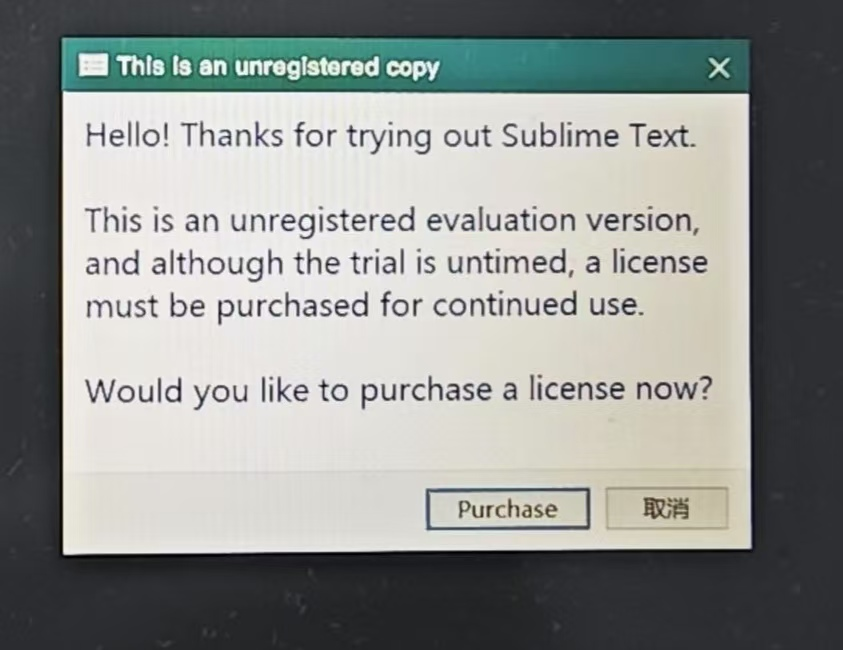
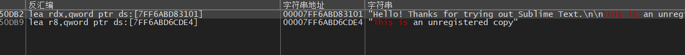
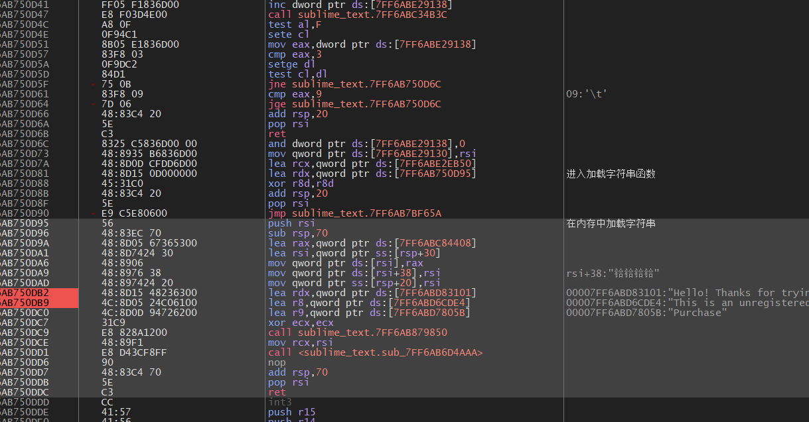
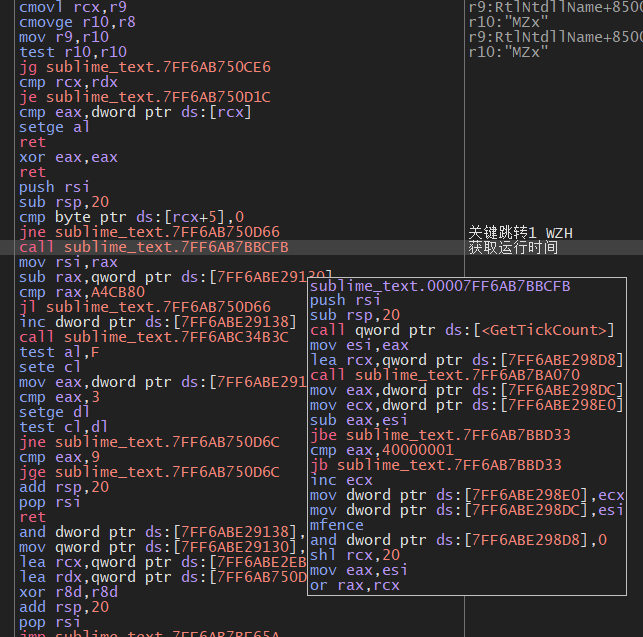
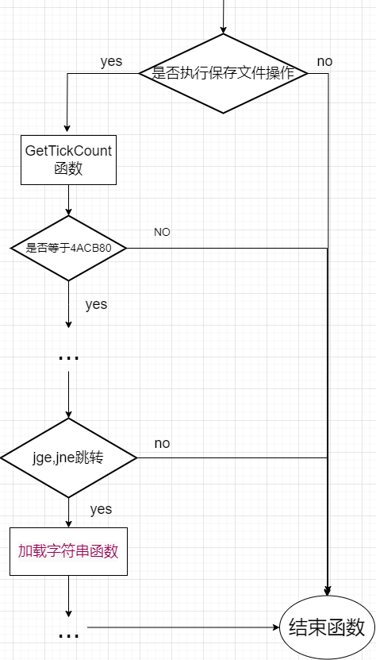

+++
author = "aobara"
title = "sublime text4暴力破解小记"
date = "2024-08-22"
description = "我将在此文中演示如何使用字符串追踪法暴力破解SublimeText Build 4180版本"

categories = [
    "破解",
    "笔记",
]
series = ["Themes Guide"]
image = "title.jpg"
+++

## 什么是Sublime Text
>Sublime Text 是一款功能强大的跨平台文本编辑器，适用于代码、标记和散文。它支持多种编程语言和标记语言，用户可以使用主题进行定制，并通过插件扩展其功能。
>
我自己比较习惯使用Sublime text作为我日常使用的文本编辑器,原因如下：

- 跨平台：我常常在Windows与Arch两个系统中切换使用。我不怎么爱用vim,nano这些编辑器。因为我不想重装完系统后有重新配置vim，而Sublime的话可以基本开箱即用(虽说有dotfiles这种方便的东西，但我太懒了并没有想学的想法)
- 轻量：我就是看Electron应用不顺眼
- Package Manager生态：有不错的color scheme,我挺喜欢；还有Markdown插件，让我少了个用VSC的理由（苦笑）  
...

## 为什么要自己破解
sublime的付费版相较于免费版在功能上没有区别，就少了个会随时提醒你赞助的弹窗。听起来好像无伤大雅，但当你进入工作环境后需要疯狂按 `Ctrl+S` 时它真的很烦人！！！  
我曾在52上寻找过破解版，它们都些让我劝退的原因：
- 无法使用Package Manager：没有Package Manager的sublime是十分难用的，不装插件它甚至不支持 UTF-8
- 触发防破解机制

最后被逼得穷途末路只好自己破解

## 进入正题

**我有两年没搞破解了，很多破解知识已经忘干净了，所以有低级错误请见谅😥**
### 分析

首先我们要明确我们的目的---干掉这个弹窗。  
那么有这些办法可行：
1. 寻找判断是否为捐赠用户的jump，破解联网验证并拔除所有暗桩
2. 寻找控制弹窗弹出的函数,使之在任何条件下都不弹出  
显然从可操作性和时间复杂性上说2方案更无脑且更简单,所以我选择2方案

### 前置操作
先用PEID查壳...没查到。那再试试万能脱壳机...也不行。
好吧，尝试自己脱壳，反正可以用ESP大法[^1]嘛...等下，我好像没破解过64位程序唉😫  
（省略查资料的事件）  
没脱壳应该没什么关系吧（不要学我）

[^1]:[ESP 定律法 -CTF wiki](https://ctf-wiki.org/reverse/platform/windows/unpack/esp/#:~:text=ESP%20%E5%AE%9A%E5%BE%8B%E6%B3%95%20ESP%20%E5%AE%9A%E5%BE%8B%E6%B3%95%E6%98%AF%E8%84%B1%E5%A3%B3%E7%9A%84%E5%88%A9%E5%99%A8%2C%20%E6%98%AF%E5%BA%94%E7%94%A8%E9%A2%91%E7%8E%87%E6%9C%80%E9%AB%98%E7%9A%84%E8%84%B1%E5%A3%B3%E6%96%B9%E6%B3%95%E4%B9%8B%E4%B8%80.%20%E8%A6%81%E7%82%B9%20ESP%20%E5%AE%9A%E5%BE%8B%E7%9A%84%E5%8E%9F%E7%90%86%E5%9C%A8%E4%BA%8E%E5%88%A9%E7%94%A8%E7%A8%8B%E5%BA%8F%E4%B8%AD%E5%A0%86%E6%A0%88%E5%B9%B3%E8%A1%A1%E6%9D%A5%E5%BF%AB%E9%80%9F%E6%89%BE%E5%88%B0,%E7%94%B1%E4%BA%8E%E5%9C%A8%E7%A8%8B%E5%BA%8F%E8%87%AA%E8%A7%A3%E5%AF%86%E6%88%96%E8%80%85%E8%87%AA%E8%A7%A3%E5%8E%8B%E8%BF%87%E7%A8%8B%E4%B8%AD%2C%20%E4%B8%8D%E5%B0%91%E5%A3%B3%E4%BC%9A%E5%85%88%E5%B0%86%E5%BD%93%E5%89%8D%E5%AF%84%E5%AD%98%E5%99%A8%E7%8A%B6%E6%80%81%E5%8E%8B%E6%A0%88%2C%20%E5%A6%82%E4%BD%BF%E7%94%A8%20pushad%2C%20%E5%9C%A8%E8%A7%A3%E5%8E%8B%E7%BB%93%E6%9D%9F%E5%90%8E%2C%20%E4%BC%9A%E5%B0%86%E4%B9%8B%E5%89%8D%E7%9A%84%E5%AF%84%E5%AD%98%E5%99%A8%E5%80%BC%E5%87%BA%E6%A0%88%2C%20%E5%A6%82%E4%BD%BF%E7%94%A8%20popad.)
## 进入x64dbg
1. 先  `F9` 进入程序主界面
2. 搜索字符串"This is an unregistered copy"  

3. 进入函数,我们很快就看出了弹窗函数的一部分

4. 函数顶部有个jmp，这阻挠了我们分析这个子函数是哪个函数调用而来。我们对之、子函数顶部进行 ` 查找引用 ` 操作，得知就在上面标注处(下图 00007FF6AB750D81 )
```asm
00007FF6AB750D5D     | 84D1                           | test cl,dl                                        |
00007FF6AB750D5F     | 75 0B                          | jne sublime_text.7FF6AB750D6C                     |
00007FF6AB750D61     | 83F8 09                        | cmp eax,9                                         | 09:'\t'
00007FF6AB750D64     | 7D 06                          | jge sublime_text.7FF6AB750D6C                     |
00007FF6AB750D66     | 48:83C4 20                     | add rsp,20                                        |
00007FF6AB750D6A     | 5E                             | pop rsi                                           |
00007FF6AB750D6B     | C3                             | ret                                               |
00007FF6AB750D6C     | 8325 C5836D00 00               | and dword ptr ds:[7FF6ABE29138],0                 |
00007FF6AB750D73     | 48:8935 B6836D00               | mov qword ptr ds:[7FF6ABE29130],rsi               |
00007FF6AB750D7A     | 48:8D0D CFDD6D00               | lea rcx,qword ptr ds:[7FF6ABE2EB50]               |
00007FF6AB750D81     | 48:8D15 0D000000               | lea rdx,qword ptr ds:[7FF6AB750D95]               | 进入加载字符串函数

```
5. 我们进行一下简单的推理：要使窗口弹出，则必须要运行到 `进入加载字符串函数` 这个注释处，而要到这一环节着要从上方的 ` jge ` 或是 ` jne ` 跳转过来。那么我们是不是不让这两个jump执行就可以了？只能说有可能，毕竟你不清楚在两个是在子函数内的还是外面的，会不会跳过之后触发防破解代码...

6. 我们继续向上分析，挺幸运的是我们看到了 `GetTickCount` 这个系统函数，我们在 MSDN 查找它的作用。
>**GetTickCount 函数 （sysinfoapi.h）[^2]**  
>作用：检索自系统启动以来已用过的毫秒数  
>返回值：自系统启动以来经过的毫秒数。
>
>[^2]: [GetTickCount的解释 -MSDN](https://learn.microsoft.com/zh-cn/windows/win32/api/sysinfoapi/nf-sysinfoapi-gettickcount)

好的，那我们基本上可以猜出这个函数了：
 

---
 7. 那么我们就有两种改法了
 - 修改GetTickCount函数上下两个判断
 - 更改jge,jne两个跳转
 8. 这里我选择第一种，因为第二种可能会触发一些暗桩。（具体有无我也没分析）。
 这两种改法任选一个即可。
- 将jne改为jmp
- 将jl改成jmp

## 尾声
目前没遇到什么问题。